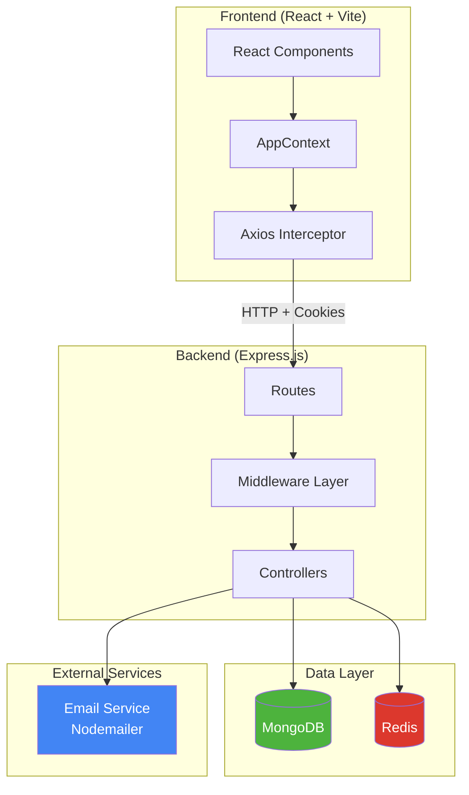
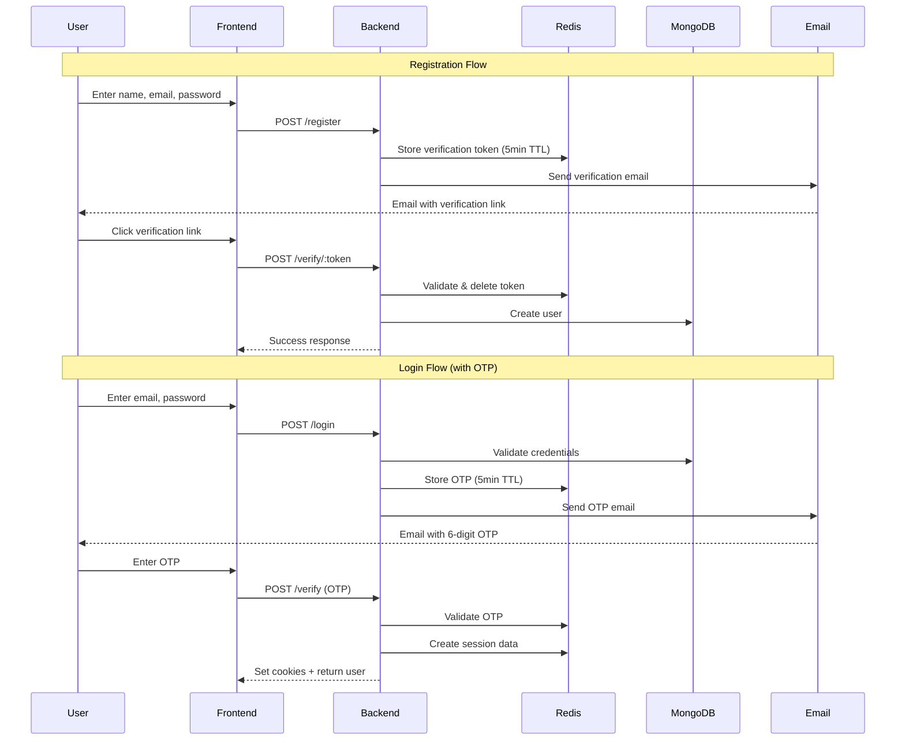
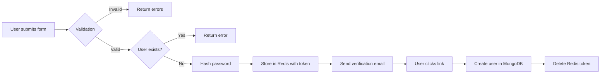
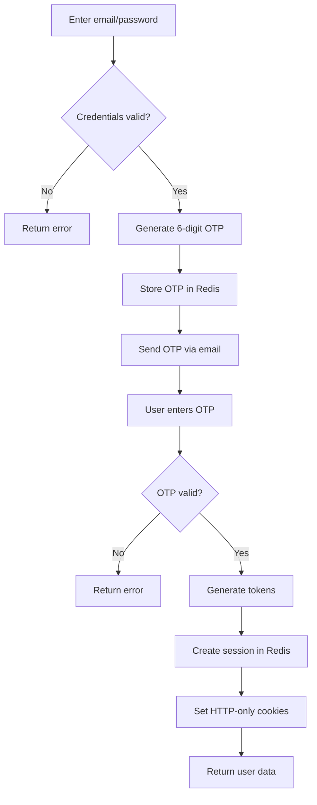
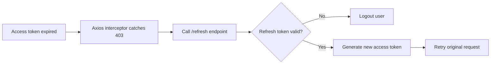
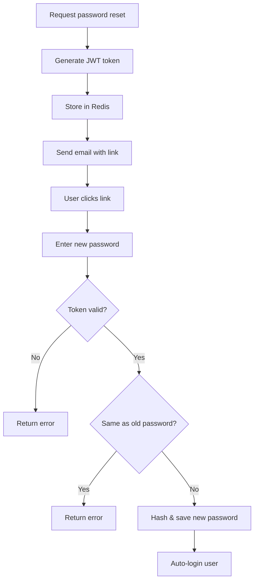

# 🔐 Secure Authentication System

A **production-ready**, full-stack authentication system built with modern security best practices including **JWT dual-token authentication**, **OTP-based 2FA**, **CSRF protection**, and **Redis-powered session management**.

---

## 📋 Table of Contents

- [Features](#-features)
- [Architecture](#-architecture)
- [Tech Stack](#-tech-stack)
- [Project Structure](#-project-structure)
- [Authentication Flows](#-authentication-flows)
- [API Endpoints](#-api-endpoints)
- [Security Features](#-security-features)
- [Setup & Installation](#-setup--installation)
- [Environment Variables](#-environment-variables)
- [Important Notes](#-important-notes)

---

## ✨ Features

| Feature | Description |
|---------|-------------|
| 📧 **Email Verification** | Token-based email verification for new registrations |
| 🔑 **OTP-Based Login** | 6-digit secure OTP sent via email for 2FA |
| 🎫 **Dual-Token JWT** | Short-lived access token (15min) + long-lived refresh token (7 days) |
| 🛡️ **CSRF Protection** | Token-based CSRF protection for state-changing operations |
| ⏱️ **Rate Limiting** | Redis-based rate limiting to prevent brute-force attacks |
| 📊 **Session Management** | Single active session per user with device detection |
| 🔄 **Auto Token Refresh** | Seamless token refresh via Axios interceptors |
| 🚫 **NoSQL Injection Prevention** | Input sanitization using mongo-sanitize |
| ✅ **Zod Validation** | Schema-based input validation |

---

## 🏗️ Architecture



### System Flow Diagram



---

## 🛠️ Tech Stack

### Backend
| Technology | Purpose |
|------------|---------|
| **Express.js 5** | Web framework |
| **MongoDB + Mongoose** | Database & ODM |
| **Redis** | Session storage, rate limiting, OTP/token storage |
| **JWT** | Access & refresh token authentication |
| **bcrypt** | Password hashing |
| **Nodemailer** | Email delivery |
| **Zod** | Input validation |
| **mongo-sanitize** | NoSQL injection prevention |

### Frontend
| Technology | Purpose |
|------------|---------|
| **React 19** | UI library |
| **Vite** | Build tool |
| **React Router 7** | Routing |
| **Axios** | HTTP client with interceptors |
| **Tailwind CSS** | Styling |
| **React Toastify** | Notifications |

---

## 📁 Project Structure

```
Authentication/
├── backend/
│   ├── config/
│   │   ├── db.js              # MongoDB connection
│   │   ├── redis.js           # Redis client setup
│   │   ├── generateToken.js   # JWT token generation & management
│   │   ├── csrfMiddleware.js  # CSRF token handling
│   │   ├── sendMail.js        # Nodemailer configuration
│   │   ├── html.js            # Email templates
│   │   ├── zod.js             # Validation schemas
│   │   └── recaptcha.js       # reCAPTCHA verification
│   ├── controllers/
│   │   └── user.controller.js # All auth business logic
│   ├── middleware/
│   │   ├── isAuth.js          # Authentication middleware
│   │   └── TryCatch.js        # Async error wrapper
│   ├── models/
│   │   └── user.model.js      # User schema
│   ├── routes/
│   │   └── user.js            # API route definitions
│   └── index.js               # App entry point
│
├── frontend/
│   ├── src/
│   │   ├── context/
│   │   │   └── AppContext.jsx # Global auth state
│   │   ├── pages/
│   │   │   ├── Login.jsx      # Login page
│   │   │   ├── Register.jsx   # Registration page
│   │   │   ├── VerifyOtp.jsx  # OTP verification
│   │   │   ├── Verify.jsx     # Email verification
│   │   │   ├── Dashboard.jsx  # Protected dashboard
│   │   │   ├── ForgotPassword.jsx
│   │   │   └── ResetPassword.jsx
│   │   ├── apiIntercepter.js  # Axios config with auto-refresh
│   │   ├── App.jsx            # Routes & app shell
│   │   └── main.jsx           # Entry point
│   └── package.json
│
└── notes.txt                  # Security best practices
```

---

## 🔄 Authentication Flows

### 1️⃣ User Registration


### 2️⃣ User Login (with OTP)


### 3️⃣ Token Refresh Flow


### 4️⃣ Password Reset Flow


---

## 📡 API Endpoints

| Method | Endpoint | Auth | Description |
|--------|----------|------|-------------|
| `POST` | `/api/v1/register` | ❌ | Register new user |
| `POST` | `/api/v1/verify/:token` | ❌ | Verify email token |
| `POST` | `/api/v1/login` | ❌ | Login (sends OTP) |
| `POST` | `/api/v1/resendOtp` | ❌ | Resend OTP |
| `POST` | `/api/v1/verify` | ❌ | Verify OTP |
| `POST` | `/api/v1/refresh` | ❌ | Refresh access token |
| `GET` | `/api/v1/me` | ✅ | Get current user profile |
| `POST` | `/api/v1/logout` | ✅ + CSRF | Logout user |
| `POST` | `/api/v1/refresh-csrf` | ✅ | Refresh CSRF token |
| `GET` | `/api/v1/admin` | ✅ + Admin | Admin-only route |
| `POST` | `/api/v1/forgot-password` | ❌ | Request password reset |
| `POST` | `/api/v1/reset-password/:token` | ❌ | Reset password |

---

## 🔒 Security Features

### Token Management
| Token Type | Storage | Lifetime | Purpose |
|------------|---------|----------|---------|
| **Access Token** | HTTP-only cookie | 15 minutes | API authentication |
| **Refresh Token** | HTTP-only cookie + Redis | 7 days | Renew access token |
| **CSRF Token** | Cookie (readable) + Redis | 1 hour | Prevent CSRF attacks |
| **Email Verification** | Redis | 5 minutes | Account activation |
| **OTP** | Redis | 5 minutes | Two-factor auth |
| **Password Reset** | JWT + Redis | 5 minutes | Password recovery |

### Redis Key Patterns
```
verify:{token}              → Pending registration data
otp:{email}                 → Login OTP
refresh_token:{userId}      → Refresh token
active_session:{userId}     → Current session ID
session:{sessionId}         → Session metadata
csrf:{userId}               → CSRF token
user:{userId}               → Cached user data (1 hour)
register_rate-limit:{ip}:{email}    → Registration rate limit
login_rate-limit:{ip}:{email}       → Login rate limit
resend_otp_rate-limit:{ip}:{email}  → OTP resend limit
forgot-password-verify:{token}      → Password reset token
```

### Security Measures
- ✅ **Password hashing** with bcrypt (10 rounds)
- ✅ **Secure cookies** (HttpOnly, Secure, SameSite)
- ✅ **CSRF protection** for state-changing operations
- ✅ **Rate limiting** (1 request/minute for sensitive operations)
- ✅ **Single session** enforcement (new login invalidates old session)
- ✅ **Input sanitization** against NoSQL injection
- ✅ **Cryptographically secure** OTP generation (`crypto.randomInt`)
- ✅ **Token validation** against Redis blacklist

---

## ⚙️ Setup & Installation

### Prerequisites
- Node.js 18+
- MongoDB (local or Atlas)
- Redis (local or Upstash)

### Installation

```bash
# Clone repository
git clone <repository-url>
cd Authentication

# Backend setup
cd backend
npm install
cp .env.example .env  # Configure environment variables
npm run dev

# Frontend setup (new terminal)
cd ../frontend
npm install
npm run dev
```

---

## 🔧 Environment Variables

### Backend (.env)
```env
# Server
PORT=5000
FRONTEND_URL=http://localhost:5173

# Database
MONGODB_URI=mongodb://localhost:27017/auth-db

# Redis
REDIS_URL=redis://localhost:6379

# JWT Secrets
JWT_SECRET_KEY=your-jwt-secret-key
REFRESH_SECRET_KEY=your-refresh-secret-key

# Email (Nodemailer)
SMTP_HOST=smtp.gmail.com
SMTP_PORT=587
SMTP_USER=your-email@gmail.com
SMTP_PASS=your-app-password
```

### Frontend (.env)
```env
VITE_API_URL=http://localhost:5000
VITE_RECAPTCHA_SITE_KEY=your-recaptcha-site-key
```

---

## ⚠️ Important Notes

### 🔐 Security Best Practices

> [!CAUTION]
> **Never commit `.env` files to version control!** Add them to `.gitignore`.

> [!IMPORTANT]
> **Use cryptographically secure random generation** for OTPs and tokens. The project uses `crypto.randomInt()` instead of `Math.random()` which is predictable.

> [!WARNING]
> **Rate limiting is essential** for production. Without it, your auth endpoints are vulnerable to brute-force attacks.

### 📝 Development Notes

1. **OTP Security**: OTPs are generated using `crypto.randomInt(100000, 1000000)` for cryptographic randomness
2. **Session Invalidation**: When a user logs in on a new device, their previous session is automatically invalidated
3. **Token Refresh**: The frontend Axios interceptor automatically handles 403 errors and refreshes tokens seamlessly
4. **CSRF Queue**: Multiple failed requests are queued and retried after CSRF token refresh to prevent race conditions

### 🚀 Production Checklist

- [ ] Set `secure: true` for all cookies (requires HTTPS)
- [ ] Configure proper CORS origins
- [ ] Use Upstash Redis for serverless environments
- [ ] Enable reCAPTCHA verification (currently commented out)
- [ ] Set strong JWT secrets (32+ characters)
- [ ] Configure proper rate limits based on expected traffic
- [ ] Set up proper logging and monitoring
- [ ] Use environment-specific configurations

### 📊 Redis Storage Recommendations

For production with Upstash Redis:
- **Free tier**: 10,000 commands/day, 256MB storage
- **Sufficient for**: ~10,000 active users
- **Monitor**: Key expiration and memory usage

---

## 📄 License

MIT License - Feel free to use this project for learning and production!
